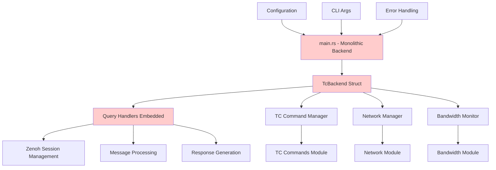
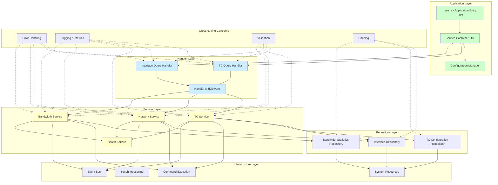
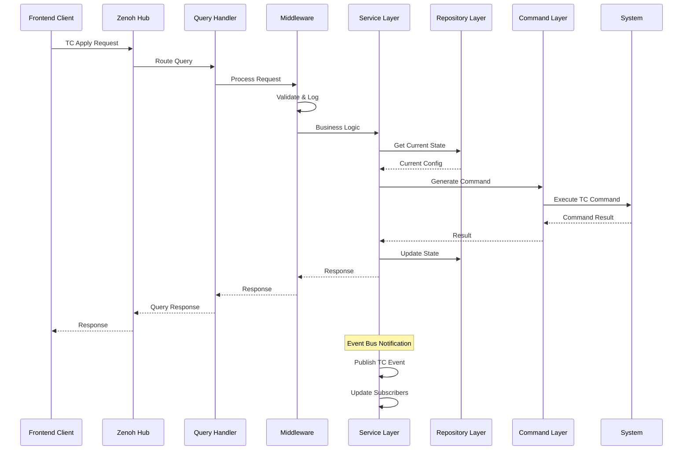
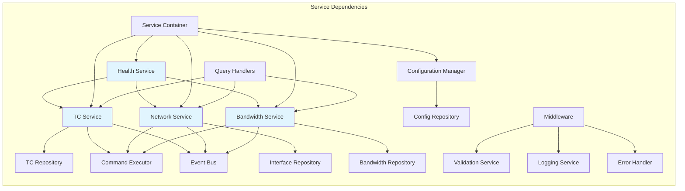
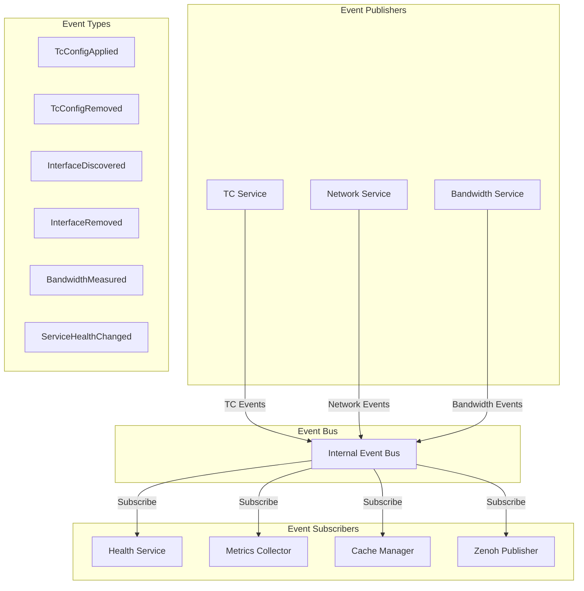
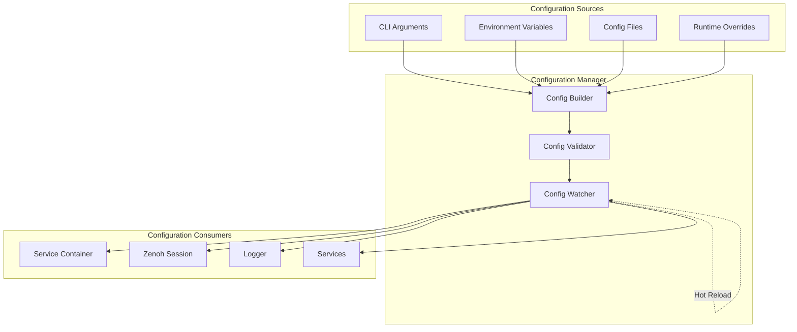

# TC GUI Backend Architecture

## Current Architecture (Before Refactoring)

### Problems with Current Architecture

1. **Single Responsibility Violation**: `TcBackend` handles too many concerns
2. **Tight Coupling**: Direct dependencies between all components
3. **Limited Testability**: Hard to mock dependencies
4. **Configuration Scattered**: No centralized config management
5. **Error Handling Inconsistent**: Different error patterns throughout
6. **No Separation**: Query handling mixed with business logic

## Target Architecture (After Refactoring)

## Layer Responsibilities

### Application Layer
- **main.rs**: Application bootstrap, dependency injection setup
- **Service Container**: Manages service lifecycles and dependencies
- **Configuration Manager**: Centralized configuration management

### Handler Layer
- **Query Handlers**: Process Zenoh queries and route to services
- **Middleware**: Cross-cutting concerns (logging, validation, error handling)

### Service Layer
- **TC Service**: Traffic control business logic
- **Network Service**: Network interface management
- **Bandwidth Service**: Monitoring and statistics
- **Health Service**: System health and diagnostics

### Repository Layer
- **Interface Repository**: Network interface state management
- **TC Repository**: Traffic control configuration persistence
- **Bandwidth Repository**: Statistics storage and retrieval

### Infrastructure Layer
- **Command Execution**: System command execution abstraction
- **Zenoh Messaging**: Message bus communication
- **System Resources**: OS-level resource access
- **Event Bus**: Internal event-driven communication

## Data Flow Architecture

## Service Dependencies

## Event-Driven Communication

## Configuration Management

## Benefits of New Architecture

### Separation of Concerns
- Each layer has a single, well-defined responsibility
- Business logic separated from infrastructure concerns
- Query handling separated from business logic

### Testability
- Dependency injection enables easy mocking
- Services can be tested in isolation
- Repository pattern allows database mocking

### Maintainability
- Clear module boundaries
- Consistent patterns across layers
- Easy to locate and modify functionality

### Scalability
- Services can be scaled independently
- Event-driven architecture supports loose coupling
- Caching can be added at repository layer

### Observability
- Health checks at every layer
- Comprehensive logging and metrics
- Distributed tracing support

## Implementation Notes

### Technology Stack
- **Rust**: Core language
- **Tokio**: Async runtime
- **Zenoh**: Distributed communication
- **Tracing**: Structured logging
- **Serde**: Serialization
- **Anyhow/ThisError**: Error handling

### Key Design Patterns
- **Dependency Injection**: Service container pattern
- **Repository Pattern**: Data access abstraction
- **Command Pattern**: Command execution abstraction
- **Observer Pattern**: Event-driven communication
- **Builder Pattern**: Configuration and command building

### Performance Considerations
- **Connection pooling** for system resources
- **Intelligent caching** at repository layer
- **Batch processing** for bulk operations
- **Async/await** throughout for non-blocking operations

This architecture provides a solid foundation for a maintainable, testable, and scalable TC GUI backend system.